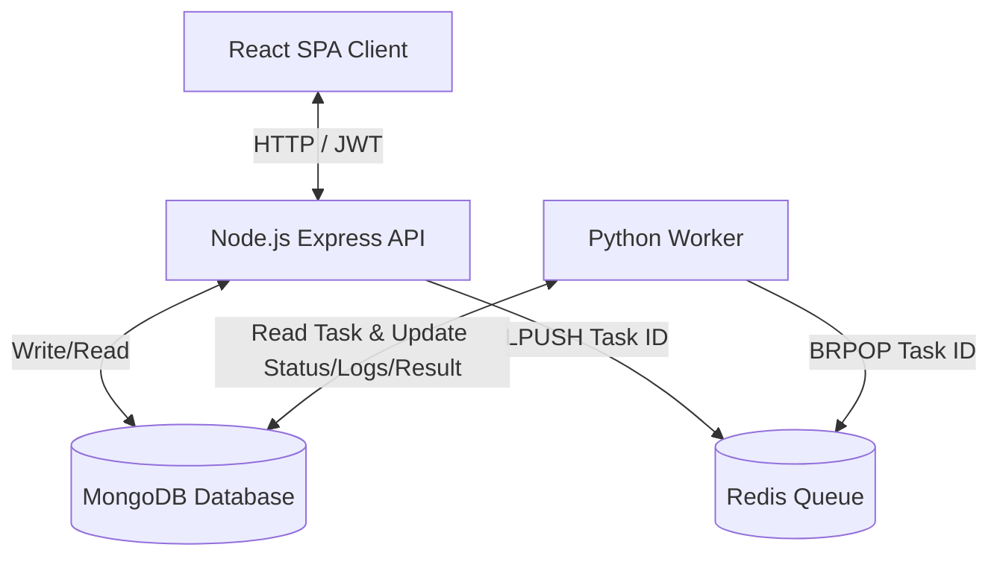

# System Architecture & Technical Design Document
## AI Task Processing Platform

This document describes the design, architecture, scaling principles, and deployment strategies of the AI Task Processing Platform.

---

## 1. System Architecture

The AI Task Processing Platform is designed on a decoupled, asynchronous, event-driven architecture. The core objective of the system is to allow users to schedule text manipulation tasks and receive results asynchronously without blocking the user interface or web server threads.

### Component Interaction Diagram

The diagram below illustrates the communication paths between the different architectural layers:



### Component Details
1. **Frontend (React.js + Vite + TailwindCSS)**:
   - A single-page application (SPA) designed as a responsive dashboard.
   - Provides views for user authentication (JWT-based registration/login), task creation, and task monitoring.
   - Leverages polling (or websocket integration compatibility) to query the backend database for updates on pending and running tasks.
   - Utilizes terminal-like rendering to display detailed processing logs generated by the worker.

2. **Backend API (Node.js + Express + TypeScript)**:
   - Serves as the gateway for the frontend, exposing RESTful endpoints.
   - Implements authentication using JWTs and password security via `bcrypt` hashing.
   - Enforces security headers through `helmet` and prevents abuse using `express-rate-limit`.
   - Handles task submission: creates a task record in MongoDB with `Pending` status, pushes the task ID to a Redis list (`task_queue`), and returns a `202 Accepted` response to the client immediately.

3. **Queue (Redis)**:
   - Serves as the message broker between the web API and background worker processes.
   - Uses a Redis list (`task_queue`) as a FIFO (First-In, First-Out) queue.
   - Provides ultra-low latency queue operations ($O(1)$ time complexity for list insertions and removals).

4. **Background Worker (Python)**:
   - A standalone service that runs concurrently with the API.
   - Utilizes a blocking pop operation (`BRPOP`) to consume task IDs from Redis.
   - Fetches the task detail from MongoDB, updates its status to `running`, performs the requested operation, and writes the execution logs and results back to the database.
   - Operates on a single-task loop to ensure predictability and ease of scaling.

5. **Database (MongoDB)**:
   - Acts as the primary persistent data store.
   - Maintains two collections: `users` (credentials and metadata) and `tasks` (inputs, outputs, execution logs, status, and metadata).
   - Designed to allow quick read access for user dashboards and sequential writes for worker logs.

---

## 2. Worker Scaling Strategy

The Python background worker is designed for horizontal scaling to adapt to variable workloads. Because the workers are completely stateless and communicate solely via Redis and MongoDB, scaling out is simple and safe.

### Horizontal Pod Autoscaling (HPA)
The application is deployed on Kubernetes, utilizing the **Horizontal Pod Autoscaler (HPA)**.

1. **Resource Metric Scaling (CPU & Memory)**:
   - The HPA (configured in `k8s/worker.yaml`) monitors the average CPU utilization across all worker pods.
   - If average CPU utilization exceeds **70%**, the HPA provisions new pods.
   - If average utilization drops below **30%** for a sustained cooldown period (defaulting to 5 minutes), the HPA terminates idle pods.

2. **Queue-Length Scaling (KEDA)**:
   - Standard resource metrics (CPU/Memory) can be slow to react to sudden spikes in task volume. For a production deployment, we recommend deploying **KEDA (Kubernetes Event-driven Autoscaling)**.
   - KEDA runs a controller in the cluster that queries the Redis queue size using `LLEN task_queue` every 15 seconds.
   - **Scale-Up Policy**: If `LLEN task_queue` > **50 tasks**, KEDA triggers immediate pod scaling.
   - **Scale-To-Zero**: During idle periods (e.g., overnight), KEDA can scale the worker replicas down to `0` or `1` to conserve resources, and instantly scale up to `10+` replicas when a batch of tasks is submitted.

---

## 3. Handling High Task Volume (100,000 Tasks/Day)

To handle 100,000 tasks/day, we evaluate the system's capacity under both average and peak loads.

### Traffic and Throughput Calculations
- **Average Workload**:
  $$\text{Average Rate} = \frac{100,000 \text{ tasks}}{86,400 \text{ seconds}} \approx 1.16 \text{ tasks/sec}$$
- **Peak Workload**:
  - Web traffic typically spikes during business hours. Assuming a **10x peak-to-average ratio**, the system must support:
  $$\text{Peak Rate} = 1.16 \times 10 \approx 11.6 \text{ tasks/sec}$$

### System Optimizations to Avoid Bottlenecks

1. **Redis Broker Capacity**:
   - A single Redis node can handle over **100,000 operations per second**. A peak load of 12 tasks/sec (representing 12 `LPUSH` and 12 `BRPOP` ops/sec) utilizes less than **0.03%** of a single Redis core's processing capacity. Redis will not be a bottleneck.

2. **Database Write Optimizations**:
   - Every task execution requires multiple database updates: creation (`Pending`), start (`Running`), intermediate log updates, and completion (`Success`/`Failed`).
   - A peak rate of 12 tasks/sec results in approximately $12 \times 4 = 48 \text{ writes/sec}$ to MongoDB.
   - **Connection Pooling**: The Node.js API and Python Worker use connection pooling (`maxPoolSize=50`) to reuse existing sockets, avoiding the overhead of establishing new TCP connections for each request.
   - **Write Concern**: We configure the MongoDB client write concern to `w: 1` (acknowledge write once written to memory and journaled). This ensures data integrity while maintaining high write speeds.
   - **Log Appending**: The Python worker appends logs directly using an aggregation pipeline update syntax (`$concat`), which minimizes document rewrite size and reduces database lock times:
     ```python
     tasks_collection.update_one(
         {"_id": ObjectId(task_id)},
         [{"$set": {"logs": {"$concat": [{"$ifNull": ["$logs", ""]}, new_log_line]}}}]
     )
     ```

3. **API Rate Limiting**:
   - Implemented via `express-rate-limit` to prevent denial-of-service conditions. Standard users are restricted to **100 requests per 15 minutes** for standard API endpoints, and **20 task runs per 15 minutes** to protect the worker queue from getting overwhelmed by single users.

---

## 4. MongoDB Indexing Strategy

To maintain sub-millisecond query response times as the database grows to millions of records, we implement the following indexing strategy:

### 1. Compound Index on User and Creation Time
- **Index Specification**:
  ```javascript
  db.tasks.createIndex({ user: 1, createdAt: -1 })
  ```
- **Rationale**: The user dashboard retrieves a user's task history sorted by the submission date (newest first). Without this index, MongoDB performs a **Collection Scan (COLLSCAN)**, loading all documents for that user into RAM to sort them. This index allows MongoDB to perform an **Index Scan (IXSCAN)**, serving sorted results directly from memory.

### 2. Status Index for Reconciliation
- **Index Specification**:
  ```javascript
  db.tasks.createIndex({ status: 1 })
  ```
- **Rationale**: An automated garbage-collection cron job checks for stuck tasks (e.g., tasks that have been in the `running` status for over 30 minutes due to worker failures). Indexing the `status` field enables rapid scanning of active tasks without scanning completed ones.

### 3. Automatic Data Pruning (TTL Index)
- **Index Specification**:
  ```javascript
  db.tasks.createIndex({ createdAt: 1 }, { expireAfterSeconds: 2592000 })
  ```
- **Rationale**: Storage costs and database performance degrade if millions of historical logs are kept forever. A Time-To-Live (TTL) index automatically purges task records older than 30 days (2,592,000 seconds), keeping the working set compact.

---

## 5. Redis Failure Handling & Recovery Strategy

Since Redis serves as the message broker, its availability is critical. If Redis crashes, the API cannot submit tasks and workers cannot fetch them. We employ a multi-layered resilience strategy.

### 1. Data Persistence (AOF and RDB)
To protect against data loss in the event of a container crash:
- **Append Only File (AOF)**: Redis logs every write command received. We set `appendfsync everysec`, ensuring that at most 1 second of queued tasks can be lost.
- **Redis Database (RDB) Snapshots**: Point-in-time snapshots are taken every 15 minutes as a fallback for faster bootstrap recovery.
- Combined, these features allow Redis to instantly reconstruct the exact queue state upon rebooting.

### 2. High Availability (HA) Topology
- **Staging**: A single Redis pod backed by a Persistent Volume Claim (PVC) is sufficient.
- **Production**: Deploy Redis in a **Redis Sentinel** topology.
  - Three Sentinel nodes monitor a Master Redis node and two Replica nodes.
  - If the Master node fails, Sentinels execute an automated failover, electing a Replica as the new Master.
  - The Node.js API and Python Worker clients are configured with Sentinel support, automatically switching their connections to the new Master without requiring a application restart.

### 3. Application Reconnection Resilience
- **API (Node.js)**: The Redis client uses an exponential backoff retry strategy. If the connection fails, it attempts to reconnect every $2^n$ seconds (capped at 30 seconds) rather than crashing the Express server.
- **Python Worker**: The worker loop catches `redis.exceptions.ConnectionError`. It logs the event, pauses for 5 seconds, and retries the connection indefinitely. Once Redis becomes available, processing resumes automatically:
  ```python
  except redis.exceptions.ConnectionError:
      print("Redis connection lost. Retrying in 5 seconds...")
      time.sleep(5)
  ```

---

## 6. Deployment Strategy

We maintain strict isolation between the Staging and Production environments.

### Environment Matrix

| Feature | Staging Environment | Production Environment |
| :--- | :--- | :--- |
| **Kubernetes Cluster** | Local (K3s / Minikube) | Managed (AWS EKS / Google GKE) |
| **Namespace** | `ai-task-platform` (Local) | `ai-task-platform` (Isolated VPC) |
| **Databases** | Containerized inside cluster | Managed (MongoDB Atlas / AWS ElastiCache) |
| **Replication** | Single replicas (with PVC) | Multi-AZ (MongoDB replica sets, Redis Sentinel) |
| **Domain & SSL** | Localhost (HTTP / Self-Signed) | Production Domain (HTTPS / Let's Encrypt) |
| **Autoscaling** | Disabled (Fixed replicas) | HPA + Cluster Autoscaler enabled |

### GitOps Argo CD Workflow
We implement GitOps to manage cluster state:
1. All Kubernetes manifests are stored in a dedicated **Infrastructure Repository** (`ai-task-infra`).
2. Argo CD is configured to track the `main` branch of the `ai-task-infra` repository.
3. When changes are pushed (via CI/CD or manual updates), Argo CD detects the diff and triggers an **Auto-Sync** cycle.
4. Argo CD applies changes using a rolling-update strategy, ensuring zero-downtime deployment for the frontend, backend, and worker services.
5. In case of issues, rolling back is as simple as reverting the git commit in the Infrastructure Repository.
