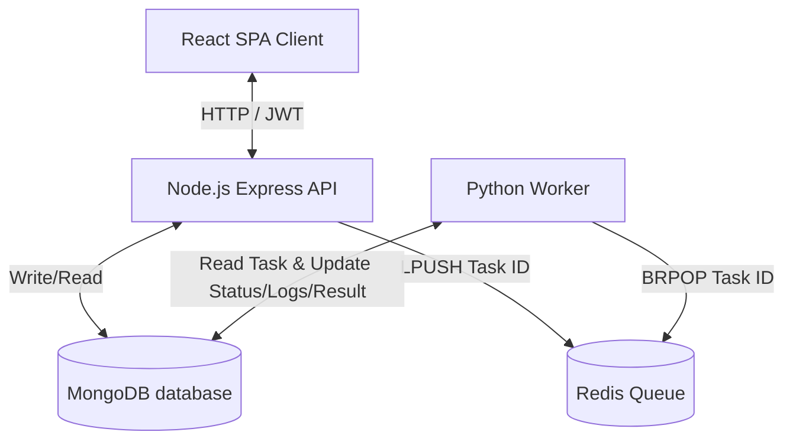

# System Architecture & Design Document
## AI Task Processing Platform

This document describes the design, architecture, scaling principles, and deployment strategies of the AI Task Processing Platform.

---

## 1. System Architecture

The AI Task Processing Platform is built on a decoupled, event-driven architecture designed to process text manipulation requests asynchronously. 

### Component Interaction Diagram



### Component Details
1. **Frontend (React.js + Vite + TailwindCSS)**: A high-fidelity single-page application (SPA) allowing users to register, log in, create tasks, and monitor task logs and results in real time. It uses periodic polling to query the backend database for updates on pending/running tasks.
2. **Backend API (Node.js + Express + TypeScript)**: A RESTful API handling authentication (JWT, bcrypt), task validation, and CRUD operations. Upon receiving a run request, it creates a `pending` database record and pushes the task ID to the Redis queue.
3. **Queue (Redis)**: A lightweight, high-performance in-memory queue. It stores task IDs in a Redis list (`task_queue`) acting as a broker between the backend API and the workers.
4. **Background Worker (Python)**: A lightweight consumer process that blocks on the Redis queue using `BRPOP`. Once a task ID is popped, it updates the task status in MongoDB to `running`, performs the string operation, and writes the success/failure state along with detailed logs and results back to MongoDB.
5. **Database (MongoDB)**: The single source of truth for application state, storing user accounts and task execution records (including inputs, outputs, statuses, and log text).

---

## 2. Worker Scaling Strategy

To handle fluctuations in request volume, the background worker cluster scales dynamically.

### Horizontal Pod Autoscaling (HPA)
The platform utilizes the Kubernetes Horizontal Pod Autoscaler (HPA) to scale worker pods.
- **Resource Metric Scaling**: The default configuration (provided in `k8s/worker.yaml`) triggers scale-out events when average CPU utilization exceeds **70%**.
- **Queue-Length Scaling (Advanced)**: Under production loads, CPU utilization may not represent queue backlogs (e.g., if tasks are network-bound). We recommend using **KEDA (Kubernetes Event-driven Autoscaling)**. KEDA monitors the Redis list size (`LLEN task_queue`) directly:
  - If the queue length exceeds **50 tasks**, KEDA spins up additional workers.
  - If the queue drops to **0**, workers scale down to `minReplicas` (e.g., 1 pod) to conserve resources.

---

## 3. Handling High Task Volume (100,000 Tasks/Day)

Processing 100,000 tasks/day translates to:
- **Average rate**: $\approx 1.15 \text{ tasks/second}$
- **Peak rate**: Assuming a peak-to-average ratio of 10x, the system must handle up to **12 tasks/second**.

### Throughput Optimizations
1. **Queue Efficiency**: Redis is capable of handling over **100,000 operations/sec** on a single core. The `LPUSH` and `BRPOP` operations are $O(1)$, presenting zero bottleneck for 100k tasks/day.
2. **Database Write Optimizations**:
   - **Connection Pooling**: Mongoose uses connection pooling by default.
   - **Write Concern**: Set MongoDB write concern to `w: 1` (journaled) for an optimal balance between security and performance.
   - **Sharding**: If volume grows to millions of tasks/day, shard MongoDB collections using a hashed shard key based on `user_id` or `task_id` to distribute write load.
3. **API Rate Limiting**: The backend employs rate-limiting (`express-rate-limit`) to prevent abuse and ensure high availability under heavy load.

---

## 4. MongoDB Indexing Strategy

To support fast dashboard renders and scale to millions of records, the following index design is implemented:

### Implemented Indexes
1. **Compound Index on User and Creation Time**:
   ```javascript
   db.tasks.createIndex({ user: 1, createdAt: -1 })
   ```
   - **Rationale**: When a user logs in, the dashboard loads their execution history sorted from newest to oldest. This index allows MongoDB to satisfy the query directly from index memory, avoiding expensive in-memory sorts (CollScan).
2. **Status Index**:
   ```javascript
   db.tasks.createIndex({ status: 1 })
   ```
   - **Rationale**: Used by administrative analytics or backend reconciliation crons that search for stuck tasks (e.g., tasks remaining in `running` or `pending` status for over 1 hour).
3. **TTL Index for Old Records (Optional)**:
   - To prevent unbounded database growth, a Time-To-Live (TTL) index can be applied to delete task documents older than 30 days automatically.

---

## 5. Redis Failure Handling & Recovery

Redis is critical for task orchestration. If it fails, task execution halts. The following strategy ensures resilience:

### Persistence Config
To prevent data loss of queued tasks during Redis container crashes:
- Enable **AOF (Append Only File)** persistence. AOF logs every write command received by the server. Under production configs:
  ```conf
  appendonly yes
  appendfsync everysec
  ```
- Combine AOF with **RDB (snapshots)** for fast startup recovery.

### High Availability (HA)
- **Staging**: A single replica Redis with persistent volume claims is sufficient.
- **Production**: Deploy Redis in a **Sentinel** or **Redis Cluster** configuration. Sentinel automates failover, promoting a replica to master if the primary node goes down.

### Application Resilience
- **Node.js**: The `redis` client is configured with reconnection logic. If connection drops, it retries connecting automatically rather than throwing unhandled process exceptions.
- **Python Worker**: The worker loop catches `redis.exceptions.ConnectionError` and sleeps for 5 seconds before retrying, ensuring it resumes immediately once Redis comes back online.

---

## 6. Deployment Strategy

### Staging Environment
- **Cluster**: Single-node Kubernetes (e.g., K3s, Minikube, or local Docker Desktop K8s).
- **Database/Redis**: Co-deployed inside the cluster using persistent volumes for simplicity and cost efficiency.
- **Namespace**: `ai-task-platform` (isolated from other staging services).
- **SSL**: Self-signed certificate or bypassed via Ingress.

### Production Environment
- **Cluster**: Managed Kubernetes Service (e.g., AWS EKS, Google GKE, Azure AKS) spanning multiple Availability Zones (Multi-AZ).
- **Databases**: Hosted on fully-managed, highly-available services (e.g., MongoDB Atlas, AWS ElastiCache for Redis) rather than co-deployed inside the cluster.
- **CI/CD Pipeline**:
  - Code changes trigger automatic builds on GitHub Actions or GitLab CI.
  - Builds create optimized multi-stage Docker images tagged with the commit SHA and push them to private registries (e.g., ECR, GCR).
  - The pipeline automatically updates the image tag in the GitOps Infrastructure Repository.
- **GitOps Deployment**: Argo CD monitors the Infrastructure Repository and automatically reconciles the cluster to match the declared manifests.
- **Monitoring**: Prometheus and Grafana track queue size, worker CPU utilization, API latency, and database operations.
